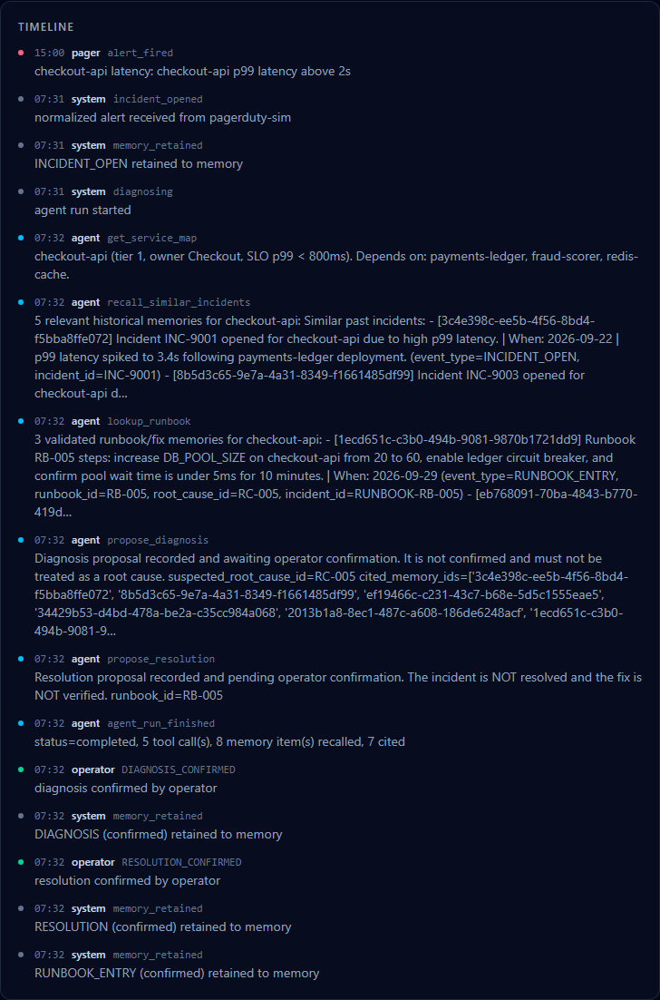
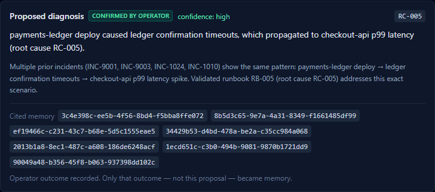
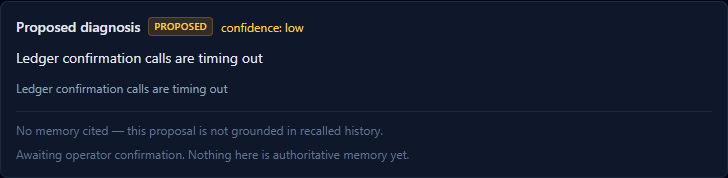
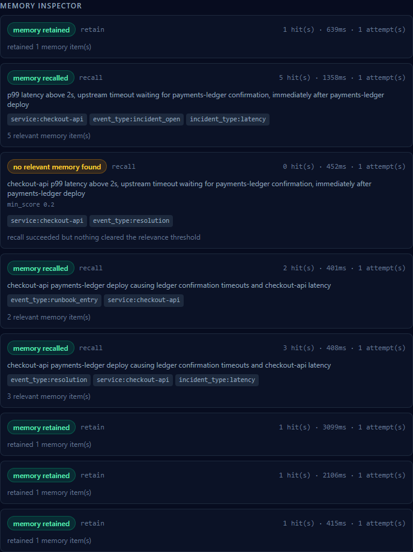
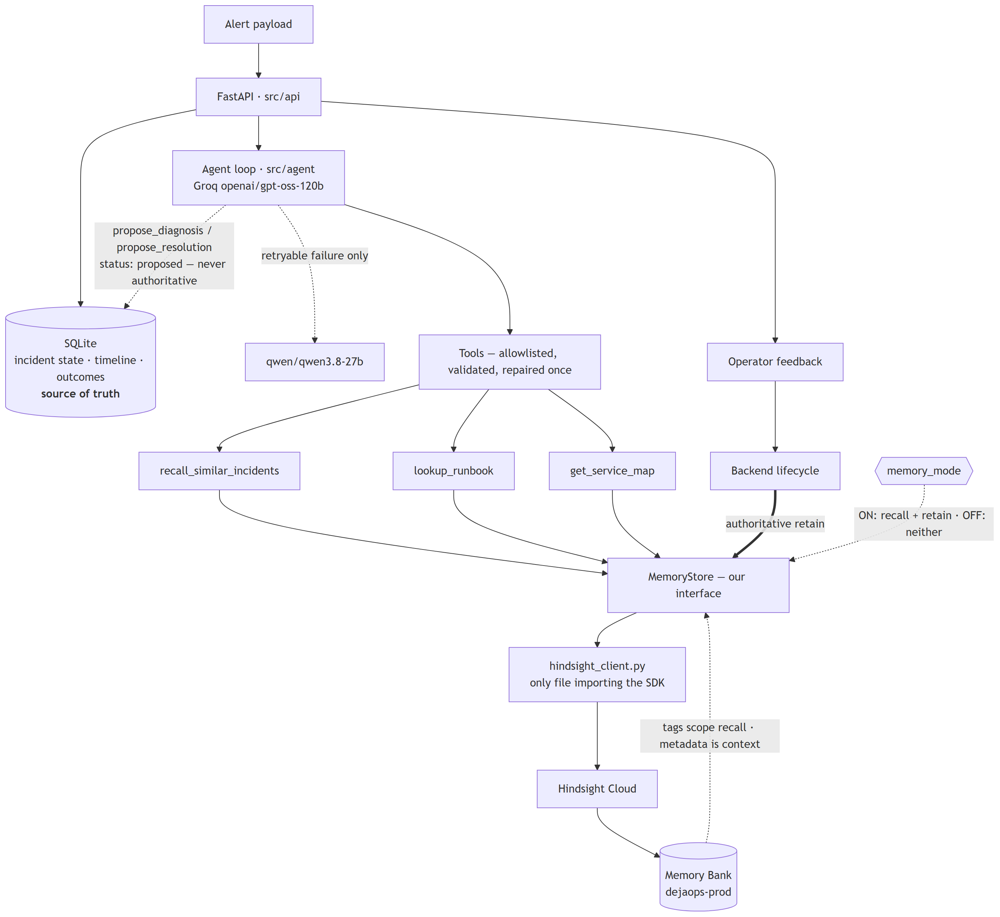
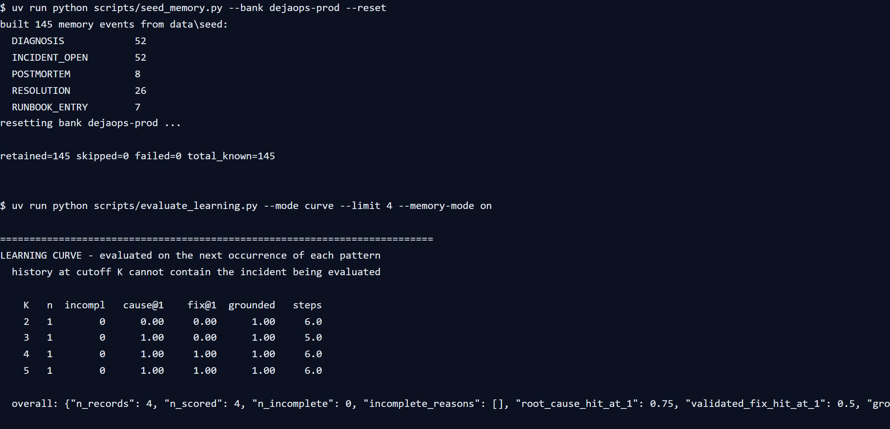

# DejaOps

**The on-call agent that has seen this incident before.**

DejaOps is an incident-response agent for a (fictional) payments company, NimbusPay. When an alert
fires, it recalls similar past incidents, prior root causes, validated fixes, and operator
corrections, then proposes a grounded diagnosis and runbook. Confirmed outcomes become durable
memory, so the system gets more useful the more incidents it works.

Memory is not a cosmetic feature here. It is the product: the same alert is answered differently
once the system has seen its outcome before, and the difference is measurable.

> **Status:** under active development. See [Definition of Done](#status) below for what is
> verified today. Nothing in this README is claimed unless it was produced by an actual run
> recorded in this repository.

---

## The problem

On-call engineers burn the first 30–45 minutes of an incident rediscovering something a colleague
already solved. Runbooks go stale. The knowledge that actually resolves incidents lives in
people's heads and in old Slack threads.

## What DejaOps does

1. An alert arrives and is normalized into an incident (`service`, `severity`, `incident_type`,
   symptom cluster).
2. With **memory ON**, the agent recalls similar past incidents and validated runbooks before
   diagnosing.
3. The agent proposes a diagnosis and a resolution. Proposals are just that — proposals.
4. An operator confirms, rejects, or corrects the outcome.
5. Only confirmed outcomes become authoritative memory. A hallucinated "resolved!" cannot poison
   future recall.
6. A confirmed resolution can be promoted into a reusable runbook entry.

The UI shows a memory ON/OFF toggle so the effect of memory is directly observable on the same
alert with the same model configuration.

After an operator confirms both the diagnosis and the resolution, the timeline records the
confirmation and the state that produced it:



---

## Where Hindsight sits

Hindsight is the memory layer. It stores durable operational facts and answers recall queries
scoped by tags. Everything else — incidents, timelines, operator outcomes — lives in SQLite.

Only one file in this repository imports the Hindsight SDK:

```
src/memory/hindsight_client.py
```

The rest of the application depends on our own `MemoryStore` interface
(`src/memory/interface.py`). That boundary is what makes it possible to switch memory OFF, swap a
Hindsight deployment, or test memory behaviour with a fake.

### What is retained

| Event type | Created by | Notes |
| --- | --- | --- |
| `INCIDENT_OPEN` | backend, automatically | normalized alert summary and initial signals |
| `DIAGNOSIS` | backend, on operator outcome | includes whether it was confirmed, rejected, or inconclusive |
| `RESOLUTION` | backend, **only** on explicit operator confirmation | validated fix, verification result, time-to-resolve |
| `POSTMORTEM` | backend | root cause, contributing factors, prevention |
| `RUNBOOK_ENTRY` | backend, promoted from a confirmed resolution | validated fix recipe |
| `OPERATOR_CORRECTION` | backend, on explicit operator correction | the operator's authoritative cause/fix |

Ordinary chat turns are **not** retained. Durable memory comes from qualifying incident events and
explicit operator feedback only.

### What is recalled, and how it is scoped

Recall happens at three moments: when a new alert arrives (similar past incidents), during
diagnosis (prior root causes and symptom patterns), and before proposing a fix (validated
runbooks for the suspected cause).

Scoping uses **tags**. Context travels in **metadata**.

| Mechanism | Purpose | Examples |
| --- | --- | --- |
| `tags` | recall scoping / filtering | `service:checkout-api`, `severity:p1`, `incident_type:latency`, `environment:prod`, `event_type:postmortem` |
| `metadata` | context returned with the memory | `incident_id`, `event_type`, `source`, `timestamp`, `runbook_id` |

Tags and metadata are deliberately not interchangeable. Metadata is never used as a recall filter.
Because Hindsight returns low-relevance neighbours rather than an empty list, recall applies a
minimum final score threshold so that "no relevant historical match" is an honest statement rather
than a near-miss dressed up as evidence.

### Memory ON vs OFF

| | memory ON | memory OFF |
| --- | --- | --- |
| Hindsight recall | yes | **no call at all** |
| Hindsight retain | yes | **no call at all** |
| memory-derived context in the prompt | yes | no |
| run labelled | `memory_mode=on` | `memory_mode=off` |

Both modes use the same normalized alert, the same model configuration, and the same system prompt.
The only difference is memory availability and the memory-derived context block.

Same alert, same model, same prompt. These two images are from real runs against the real Hindsight
bank — not from the test harness, whose model is a fake:

| memory ON | memory OFF |
| --- | --- |
|  |  |

With memory ON the agent named the root cause and cited the memories it reasoned from. With memory
off it has no precedent to point at, so it says so and sets confidence to low.

The Memory Inspector distinguishes four states explicitly, and never invents a memory:

```
memory recalled
memory retained
no relevant memory found
memory service unavailable
```

`memory off` is a fifth, separate state: a run with memory off has no traces at
all, and the Inspector says Hindsight was not called rather than reporting an
empty result. "No memory was consulted" and "no relevant memory was found" are
different claims, and the UI does not blur them.

In the UI the toggle is per-request, so the same alert can be run both ways
without restarting anything. Each incident carries the mode it ran in, and the
**Re-run with memory off/on** button replays the current alert in the other mode
— which is the whole comparison in one click.

The Inspector shows each recall and retain attempt with its own outcome. Recalls and the three
retains that a confirmed outcome produces:



### Degradation policy

Transient Hindsight failures are retried with bounded exponential backoff. Permanent
validation/authentication errors are not retried. After retries are exhausted the run continues in
degraded mode and the Memory Inspector says so. A failed authoritative retain is never reported as
a successful one.

A malformed result inside an otherwise successful recall is rejected and logged, and the well-formed
results beside it are kept. Letting it raise would present a bad row as a provider outage and spend
the retry budget on something retrying cannot fix; letting it through would hand the model a hit with
no id, which it could cite and which could not be traced back to a memory. A result with no id or no
text is not evidence; a result with an unparseable score keeps its text and loses only the score.

---

## Quickstart

Requires Python 3.11+, [uv](https://docs.astral.sh/uv/), and Node 20+ for the frontend.

```bash
git clone https://github.com/sujal-suhaas/HWH-Sept28-26.git
cd HWH-Sept28-26
cp .env.example .env      # then fill in HINDSIGHT_API_KEY and GROQ_API_KEY
uv sync
uv run uvicorn src.api.app:app --reload --port 8000
```

Check it is alive:

```bash
curl -s http://localhost:8000/health
curl -s http://localhost:8000/health/memory
```

Every configuration key is documented in [`.env.example`](.env.example).

### Tests

```bash
uv run pytest        # backend unit tests, no network required
uv run ruff check .

cd frontend
npm test             # component and unit tests
npm run typecheck
npm run build
```

### The browser happy path

The end-to-end test drives alert → recall → grounded diagnosis → operator
confirmation → visible memory trace. It runs against
[`scripts/serve_e2e.py`](scripts/serve_e2e.py), a harness that serves the real
routes, the real contract and the real trace log but replaces the model and the
memory provider with fakes — so it needs no API keys and is reproducible.

```bash
cd frontend
npm run test:e2e:install   # one-off: Chromium
npm run test:e2e
```

It starts both servers itself. To run it against the live Hindsight and Groq
stack instead, start the backend with real keys and run
`npx playwright test` with `reuseExistingServer` already satisfied.

### Pointing the UI at a data source

The UI talks to the live API by default. Add `?source=mock` to the URL to use the
hand-written fixtures instead — useful offline, and what the component tests do.
The header always shows which one is in use; the app never falls back silently.

---

## Architecture

```
alert ──▶ FastAPI ──▶ incident (SQLite: source of truth for state + timeline)
                 │
                 ├─▶ agent loop (Groq) ──▶ tool calls ──▶ validated + repaired
                 │                              │
                 │                              ├─ recall_similar_incidents ─┐
                 │                              ├─ lookup_runbook ───────────┤
                 │                              └─ get_service_map           │
                 │                                                          ▼
                 └─▶ operator feedback ──▶ authoritative retain ──▶  ┌──────────────────┐
                                                                     │ MemoryStore      │
                                                                     │  (interface)     │
                                                                     └────────┬─────────┘
                                                                              │ only this file
                                                                              ▼
                                                                     hindsight_client.py
                                                                              │
                                                                              ▼
                                                                        Hindsight
```

The agent may *propose*. Only the backend lifecycle may *commit* an authoritative memory.

The same map with the Memory Bank and the confirmation boundary drawn in. The bank is one container
behind one adapter file, and only one of the two arrows into the store is a write:



A generated copy lives at `docs/images/architecture.png`; `frontend/tools/capture-diagram.mjs`
renders it from the mermaid block in [`docs/architecture.md`](docs/architecture.md) so the two cannot
drift apart.

---

## Status

Phase 0–5:

- [x] Backend boots, `/health` returns 200
- [x] Memory adapter isolated behind `src/memory/hindsight_client.py`
- [x] Tags used for recall scoping, metadata for context
- [x] Memory ON/OFF switch with a no-call OFF store
- [x] Bounded retry with honest degradation, including malformed results
- [x] Unit tests for the memory layer, including failure paths
- [x] Agent loop, tools, Groq client with model fallback
- [x] HTTP routes for incidents, chat, and operator feedback
- [x] Frontend: alert feed, timeline, chat, Memory Inspector, memory toggle
- [x] Operator feedback controls with visible confirmation state
- [x] NimbusPay dataset and Hindsight seeding
- [x] Playwright happy path
- [x] Learning evaluation with measured results — one pattern ladder and one teach replay, both on
      the primary model. See [`docs/architecture.md`](docs/architecture.md) §10.7
- [x] Screenshots from a live run, captured against the real Hindsight bank and the real models —
      see [`docs/images/`](docs/images). The capture tools are committed in `frontend/tools/`, so
      the images can be regenerated rather than trusted. Capturing them found two real bugs, both
      since fixed: a completed run that proposed nothing left the incident stuck in `DIAGNOSING`
      (#39), and confirming a resolution reset the diagnosis card to "proposed" on a resolved
      incident (#40, #41).

Seeding the bank and evaluating the learning curve, as actually run:



The `overall` line reads `root_cause_hit_at_1: 0.75`, `validated_fix_hit_at_1: 0.5`,
`grounded_response_rate: 1.0`, `fallback_runs: 0`, `models_used: ["openai/gpt-oss-120b"]`. Those
figures are four runs at four history cutoffs on **one** pattern, and the caveat travels with them:
`n = 1` per cutoff, so this is a ladder, not a rate. See
[`docs/architecture.md`](docs/architecture.md) §10.7.

See [`docs/architecture.md`](docs/architecture.md) for the verified Hindsight
behaviour this design depends on, and why each decision was made. §10.8 records
the two bugs that running the evaluation found — one of which the test suite
could not have caught.

## License

MIT — see [LICENSE](LICENSE).
